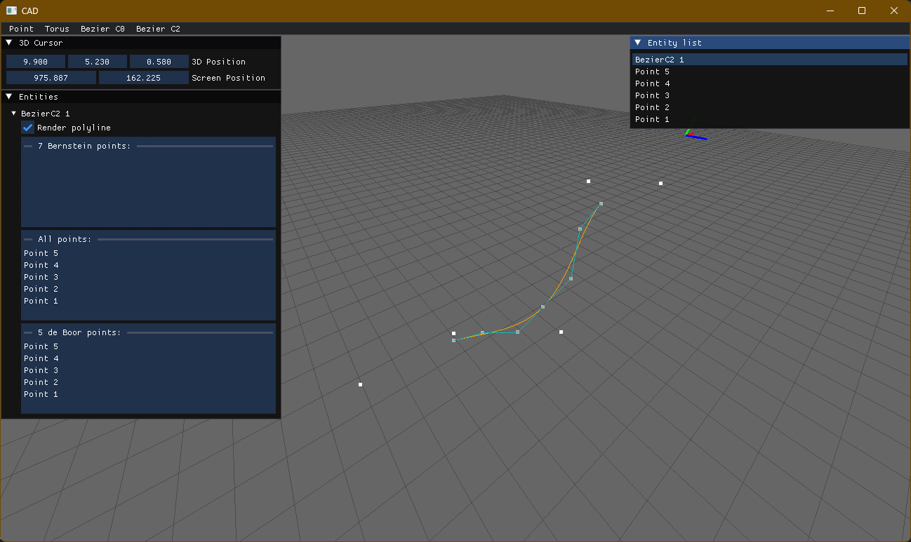

# CAD

This project is an attempt to build the CAD system (computer-aided design) using the following technologies and libraries:
- OpenGL API
- C++20
- [Dear ImGui](https://github.com/ocornut/imgui)
- [entt](https://github.com/skypjack/entt)

using the entity-component-system (ECS) architecture pattern.

### Implemented functionalities:
- moving, rotating and scaling of the scene
- adding the folowing types of objects to the scene:
  - points
  - torus (with modifiable parameters)
  - Bezier C0 curve (interactive changing of the curve)
  - Bezier C2 curve (interactive changing of the curve) - both Bernstein and B-spline representations
- list of objects present on the scene
  - selecting/unselecting the object (ctrl+click on the object on the scene or on the list)\
  - renaming the objects
  - transformations on the group of the objects

# Screenshots

*Torus*

*Bezier C0 curve*

*Bezier C2 curve*

*Live modifications of Bezier C2 curve*
